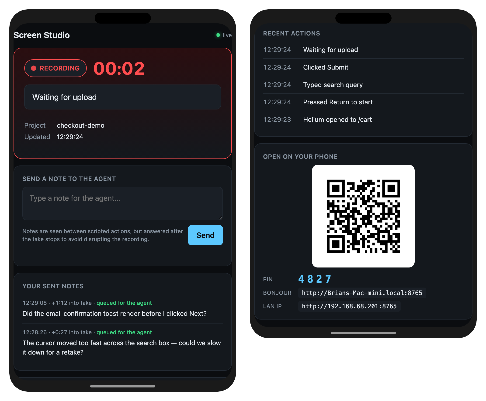

# screen-studio

A skill that helps AI agents record polished, repeatable macOS screencasts with
[Screen Studio](https://www.screen.studio/). It guides capture-scope selection,
clean Helium browser setup for web demos, scripted dry runs, coordinate
calibration with `cliclick`, Screen Studio shortcut usage, smoke captures, and
keeper-take verification with `ffprobe` and timestamp contact sheets.

The full agent instructions live in [`SKILL.md`](SKILL.md).

## Install

```bash
npx skills add https://github.com/NerdOutInc/ai-skills --skill screen-studio
```

## Usage

Invoke the skill explicitly when you want to record — it does not auto-load
on intent:

- **Claude Code:** type `/screen-studio` and then describe the recording.
- **Codex:** type `$screen-studio` and then describe the recording.

Example: `/screen-studio` then "record a screencast of the checkout flow."

The skill captures the **full display only** — window or selected-area
capture is out of scope.

A typical session:

1. **Status server starts.** The agent shares a QR code, PIN, and
   Bonjour/LAN URL — scan it with your phone to monitor the take live on a
   second device. See [Recording status server](#recording-status-server)
   below.
2. **Dry runs.** At least two rehearsals without recording, so the agent
   can lock in coordinates, waits, and the visible action sequence before
   committing to a keeper.
3. **Keeper take.** The agent drives Screen Studio with the recording
   keyboard shortcut and runs the rehearsed steps. While recording, you
   can send timestamped notes from your phone (e.g. "the cursor moved too
   fast at 0:42") and the agent will answer them during the post-take
   debrief.
4. **Verification.** After stopping, the agent measures the display track
   with `ffprobe`, generates a timestamp contact sheet, and reviews frames
   before declaring the take a keeper or rejecting it.
5. **Output.** Recordings land in `~/Screen Studio Projects/`. The agent
   does **not** trim, export, or upload unless you explicitly ask.

For the full agent-facing protocol — exact shortcuts, status server CLI,
note polling cadence — see [`SKILL.md`](SKILL.md).

## Recording status server



The skill ships a tiny self-contained recording status server (a precompiled
universal macOS binary, zero runtime dependencies). The agent starts it at the
top of every session, generates a fresh 4-digit PIN, and shares both URLs
(Bonjour + LAN IP) plus a QR code that encodes the LAN URL with the PIN
embedded — scan it with a phone camera to open the page in one tap. The page
shows the live recording phase, elapsed clock, and rolling action log, and
lets you send timestamped notes ("the cursor moved too fast at 0:42", "did the
dropdown render before I clicked?") that the agent reads and responds to in
chat as part of the post-take debrief.

See the [Recording Status Server](SKILL.md#recording-status-server) section of
`SKILL.md` for the full protocol — flags, endpoints, and CLI subcommands.

## Dependencies

The agent checks for these at the point in the workflow where they're needed
and will ask before running `brew install`. They're listed here so you can
pre-install them once and skip the prompt on every session.

### Required

- **[Screen Studio](https://www.screen.studio/)** — the recording app this
  skill drives. Install from the developer's site.
- **[ffmpeg](https://www.ffmpeg.org)** (provides `ffprobe`) — duration checks on the display track,
  timestamp contact sheets for keeper verification, and m4a→wav conversion
  when transcribing narration audio:

  ```bash
  brew install ffmpeg
  ```

- **[cliclick](https://github.com/BlueM/cliclick)** — visible cursor movement during keeper takes. The agent uses
  it to move the actual macOS pointer at a human pace rather than teleporting
  the cursor with scripting:

  ```bash
  brew install cliclick
  ```

- **macOS Command Line Tools** — provides the `swift` runtime used by the
  bundled helper scripts (see [Bundled](#bundled-no-install-needed) below):

  ```bash
  xcode-select --install
  ```

### Optional

- **[Helium](https://helium.computer)** — Chromium-based browser with clean chrome, preferred for web
  demos. The agent falls back to your default browser if Helium isn't
  installed.
- **[whisper-cpp](https://github.com/ggml-org/whisper.cpp)** — local audio transcription, only needed when you provide
  a voice memo without a written actions file. The Homebrew formula installs
  the `whisper-cli` binary used by the agent:

  ```bash
  brew install whisper-cpp
  ```

  After install, place a model under `$HOME/.cache/whisper.cpp/`. The
  known-good default for English narration on Apple Silicon is
  `ggml-base.en.bin`:

  ```bash
  mkdir -p "$HOME/.cache/whisper.cpp"
  curl -L \
    -o "$HOME/.cache/whisper.cpp/ggml-base.en.bin" \
    https://huggingface.co/ggerganov/whisper.cpp/resolve/main/ggml-base.en.bin
  ```

### Bundled (no install needed)

These ship inside the skill directory and don't require a separate install:

- `server/status-server` — precompiled universal macOS binary for the
  recording status server. No Python, Node, Go, or Homebrew runtime needed.
- `scripts/scroll-wheel.swift` — Swift helper for trackpad-style smooth
  scrolling during recordings. Runs via the system `swift` interpreter.
- `scripts/vision-find-text.swift` — Apple Vision text-recognition helper
  that converts on-screen text into `cliclick` coordinates. Same Swift
  runtime requirement.
